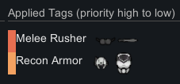
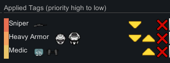
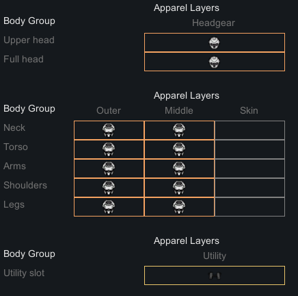
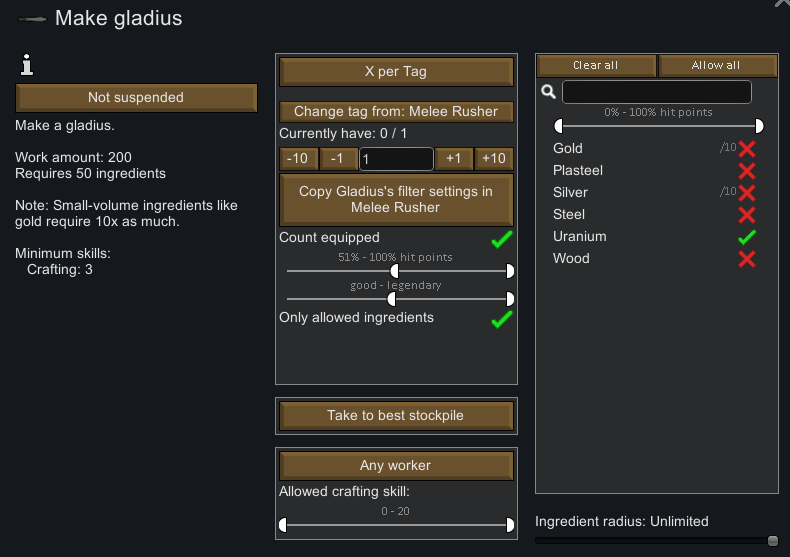
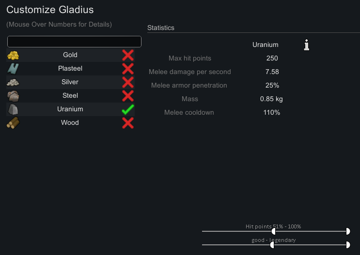

### Compositable Loadouts
A Rimworld mod designed to reduce micromanagement around allocation of resources, specifically apparel and items held by pawns. It aims to do this by introducing a system of `Tag`s which enable the user to composit (blend/merge together) multiple tags to create unique `Loadout`s for pawns. 

It also features some utility to make procuring things for tags easier, in the form of a bill system which allows users to select the number of pawns using a tag as the basis for the number of products to create.

### Off-steam download link?
[Download from Here](https://github.com/simplyWiri/Loadout-Compositing/releases/latest)

### Features
- Create tags containing items which a pawn will wear / pick up / equip automatically
- Create loadouts consisting of multiple tags for flexibility
- Create bills which make `x` number of items, where `x` is the number of pawns with the tag `y`

An Example:
I might create a series of tags, named Sniper, Recon Armor, Heavy Armor and Melee Rusher, Medic. I can then pick and choose which tags should be applied per pawn. As seen here
Melee Pawn                 |  Sniper / Medic
:-------------------------:|:-------------------------:
  |  

We are also able to view a visualisation of which BodyPartGroups are covered by the armour the Pawn is currently wearing:

We can see from this visualisation, that our pawn could actually be wearing something which covered the `Skin` ApparelLayer, and that they could be wearing Tribalwear, etc ontop of their current outfit. We could make another tag which covered this layer, and apply it only as needed.

We could also set up bills to automatically create the items used in our tags. There is also utility to copy settings that you set in the tag over to the bill.
Bill Menu                  |  Tag Edit Menu
:-------------------------:|:-------------------------:
  |  

### Contributing   
I am happy to accept contributions which add features / fix bugs. I do reserve the right to be unbelievably annoying and picky about which new features I accept though. So opening an issue talking about the feature you'd be interested in implementing is a good way for us to get on the same page.

#### Some Internal Design Points / Naming
`Panel_X` - Sub section of some GUI considered large enough to split up from the main window class

`Dialog_` - A window class 

`Item` - A custom wrapper which effectively acts as a `ThingDef` coupled with a custom version of a `ThingFilter` and a quantity, this is use to represent un-realised `Thing`s in a tag.

`Filter` - Custom version of a ThingFilter

`Tag` - A list of required `Item`s and a name (which does not have to be unique) these are owned exclusively by the `LoadoutManager` which is responsible for their deep saving / ownership.

`Loadout` & `LoadoutComponent` - This is a per-pawn item which represents a list of Tags. They do not currently contain any information outside of the tags. This may change in the future if a feature similar to HotSwapping is added.

`LoadoutManager` - A big basically global struct (GameComponent) which acts as the go-between for most things which require saving, for example Tags, extended data for bills (how does a bill know which tag it refers too).

#### How does this mod actually influence pawns actions?
Loadout resolution in this mod only really touches pawn AI in a single point, namely; [Source/AI/ThinkNode_LoadoutRealisation](Source/AI/ThinkNode_LoadoutRealisation.cs), and the more general patch which effects apparel scoring so that vanilla does not replace loadout-added items, [Source/Patches/OptimizeApparel_ApparelScoreGain_Patch.cs](Source/Patches/OptimizeApparel_ApparelScoreGain_Patch.cs).

This was originally designed to be as minimal as possible, however, with the addition of Hot-Swapping, this needed to become slightly more complex, and a lot more flexible/powerful to enable immediate loadout resolution with the press of a button.